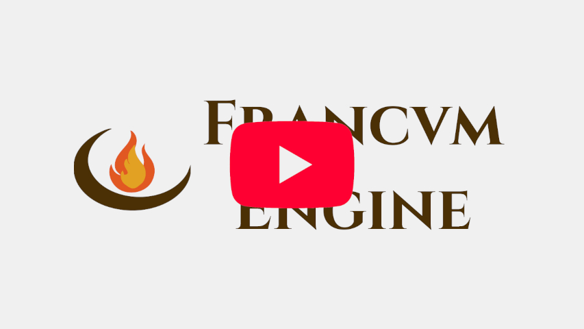

# Francum Engine

[「日本語」](README.ja.md)

**A frank, portable, and lightweight game engine in OpenGL.**

Francum Engine is built for developers who want to start creating immediately. It is "Frankly Portable"—the repository comes pre-bundled with its own toolchain (Compiler, Build System, and Scripting), meaning you can build and run games on any Windows machine without installing external software.

---

## 🚀 Features
* **Lightweight:** Minimal memory footprint and fast startup times.
* **Portable:** Includes pre-configured `g++`, `CMake`, and `Lua`. Just clone and code.
* **OpenGL Powered:** Leverages modern OpenGL for efficient rendering.
* **Frank Design:** Transparent API with no hidden "magic" behaviors.

---

## 🛠️ Getting Started

### Requirements
* **OS:** Windows 10/11 (x64)
* **Graphics:** GPU with OpenGL 4.6 support.

### Dependencies
Francum relies on the following libraries:
* **Windowing/Context:** GLFW
* **Linker/Loader:** GLAD
* **Math:** GLM
* **UI:** ImGui
* **Scripting:** Sol3

### Installation

1. **Clone the Repository**: Download or clone the FrancumEngine repository to your local machine.

2. **Run Setup**: Navigate to the project root and run `SetupProject.bat`. This handles the portable toolchain configuration automatically.

3. **Open & Build**: Open the folder in **VS Code** and press `Ctrl + Shift + B` to compile the engine.

---

## 📑 Documentation
WIP

---

## 🤝 Contributing
Contributions are welcome! Please feel free to submit a Pull Request or open an issue for bug reports and feature requests.

---

## 📄 License
This project is licensed under the MIT License - see the LICENSE file for details.